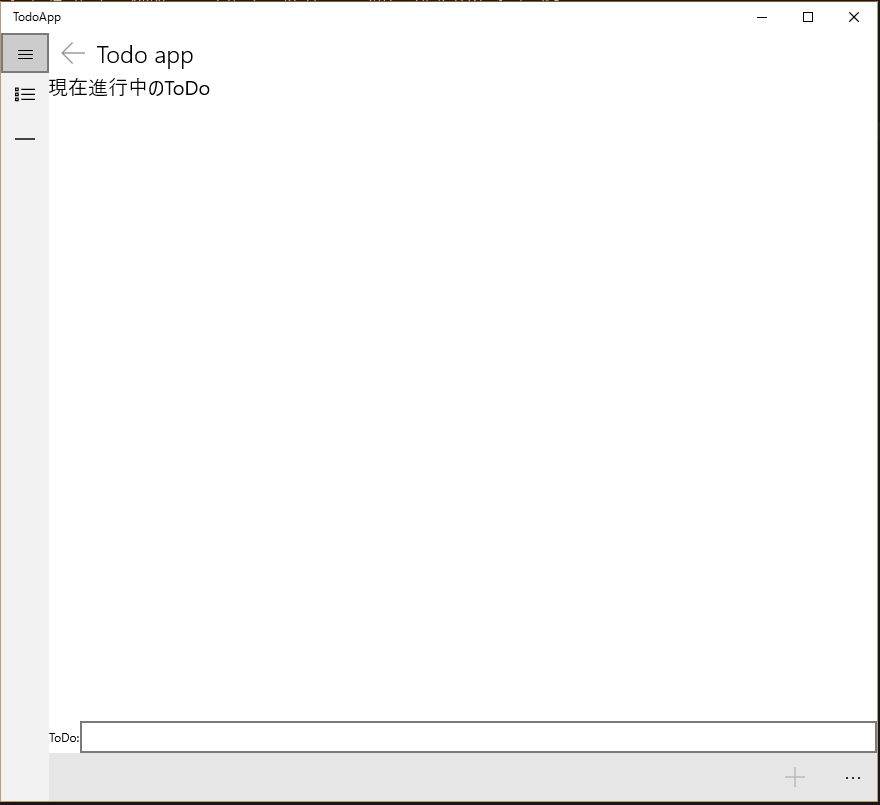

# Windows 10 サンプル ToDoアプリケーション

このアプリケーションは、Windows 10のUniversal Windows Platform appのサンプルアプリケーションです。

## 動作

起動すると以下のような画面が表示されます。

画面下部のテキストボックスにテキストを入力して＋ボタンを選択するとToDoが登録されます。

チェックボックスにチェックを入れると、ToDoが消えます。消えたToDoは画面の左側のーをクリックして表示される画面で確認できます。

アプリバーから、完了したToDoをもとに戻したり、完全に削除することができます。

画面のハンバーガーボタンを押すと、画面遷移のためのメニューを表示することができます。

ハンバーガーメニューの横の戻るボタンを押すと画面遷移を1つ戻ることができます。

Windows Phoneでも同様の操作で使用することができます。

